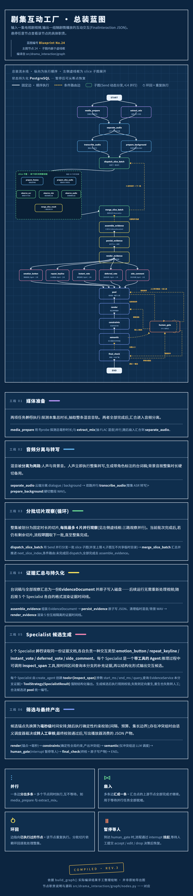

# Drama Highlight Mark V2

> 将一集短剧原始视频转换为可直接消费的即时互动 JSON。

V2 先从**完整视频**提取可追溯的台词、屏幕文字、画面和背景音观察，再生成互动；它不依赖“高光”作为中间输入。

## 它做什么

- 输入一集 `.mp4` 和该剧的简介、角色表。
- 建立带整数毫秒时间轴的整集 `EvidenceDocument`。
- 并行生成五类互动：`emotion_button`、`repeat_keyline`、`instant_vote`、`deferred_vote`、`side_comment`。
- 对候选做证据校验、时间渲染、冲突/间隔/预算约束和必要的人工处理。
- 输出后端可直接消费的最终 JSON。

它不提供播放器、账号、评论区、剧情分支、跨集记忆或本地模型部署。

## 快速开始

### 1. 准备运行环境

需要：

- Python 3.10+
- [uv](https://docs.astral.sh/uv/)
- 可在命令行调用的 FFmpeg 与 FFprobe
- 一个可访问的 PostgreSQL 数据库
- 已配置的托管模型与音轨分离服务凭据

在仓库根目录安装依赖：

```powershell
uv sync
```

### 2. 配置 `.env`

首次运行时复制模板，再填写真实值：

```powershell
if (-not (Test-Path .env)) { Copy-Item .env.example .env }
```

`.env` 中以下配置是必填的：

| 能力 | 环境变量前缀/字段 |
| --- | --- |
| Specialist 与语义调度 LLM | `LLM_*` |
| LangGraph checkpoint | `CHECKPOINT_DATABASE_URL` |
| 音轨分离 | `AUDIO_SEPARATOR_*` |
| 整集 ASR | `ASR_*` |
| 背景音观察 | `AUDIO_OBSERVER_*` |
| OCR | `OCR_*` |
| 视觉观察 | `VLM_*` |

完整模板见 [.env.example](.env.example)。`LANGSMITH_*` 仅用于可选追踪。凭据、端点和模型标识在 `.env`；所有可调运行参数和模型提示词都在 [src/drama_interaction/config.py](src/drama_interaction/config.py)。

当前实现使用腾讯云 CI 完成人声/背景音分离，使用 DashScope ASR 完成台词转写；其余多模态与文本模型走各自配置的兼容端点。环境变量以能力命名，因此不需要把供应商名称写进调用命令或产物路径。

### 3. 放置输入视频与剧集上下文

默认输入目录如下：

```text
data/video/
├── drama_info.json
└── 某短剧/
    ├── 第1集.mp4
    ├── 第2集.mp4
    └── …
```

`drama_info.json` 顶层必须是数组；其中必须有一个 `name` 等于视频父目录名的剧集记录。记录可包含 `description` 与 `characters`，用于理解角色名、关系和专有名词，不能替代本集证据。

建议先用单集验证配置：

```powershell
uv run python -m drama_interaction run "data/video/某短剧/第1集.mp4"
```

## 运行方式

```powershell
# 一集
uv run python -m drama_interaction run "data/video/某短剧/第1集.mp4"

# 一部剧，或整个视频根目录
uv run python -m drama_interaction run "data/video/某短剧"
uv run python -m drama_interaction run "data/video"
```

目录输入会递归发现 `.mp4`，按自然顺序逐集处理。批次中某一集的媒体或证据提取失败时，该集记为失败，后续集仍会继续；不会把半成品证据交给互动生成阶段。

一次成功运行会依次完成：

1. 并行探测主视频轨时长、抽取混音音轨。
2. 分离出台词与背景音，保存两个 MP3。
3. 对台词音轨执行整集 ASR；对背景音和画面按固定 3 秒范围取证。
4. 每个切片以 4 FPS 采样，OCR、VLM 与背景音观察并行；最多四个切片子图同时运行。
5. 汇总为 `EvidenceDocument`，再由五个 Specialist 并行生成、筛选和调度互动。

## 处理暂停、恢复与导出

当候选或调度无法自动决定时，流程会暂停并打印 `execution_id` 及恢复命令。使用同一个 ID 恢复：

```powershell
uv run python -m drama_interaction resume --execution-id <execution-id>
```

终端会逐项接受 `accept`、`edit` 或 `drop`。人工决定和外部中断均从 PostgreSQL checkpoint 恢复，已完成的分离、ASR 和切片不会重复执行。

完成后可只导出最终互动，不重新运行模型：

```powershell
uv run python -m drama_interaction export --execution-id <execution-id> --output output.json
```

## 产物

| 产物 | 默认位置 | 说明 |
| --- | --- | --- |
| 基线证据 | `data/evidence/<剧名>/<集名>.json` | 整集 `EvidenceDocument`；包含台词与非空客观观察。 |
| 分离音轨 | `data/evidence/<剧名>/<集名>.audio/` | `dialogue.mp3` 与 `background.mp3`，用于恢复。 |
| 最终互动 | `data/interaction_v2/<剧名>/<集名>.json` | 符合 [输出契约](docs/schema.md) 的后端 JSON。 |
| 执行快照 | `data/interaction_v2/runs/<execution_id>/state.json` | CLI 状态、HITL 项与导出入口；不是自建进度系统。 |

最终数组按展示时间排序。每项互动的展示时间来自引用证据的锚点，而不是模型自报的时间。

## 工作流结构



关键边界：

- 原始视频是生产证据的唯一来源；静态上下文只辅助理解。
- 台词使用 ASR 返回的句段时间；不做二次切句或自行修正时间。
- OCR、VLM 和背景音观察合并到同一个 `Observation`，不新增音频证据类型。
- 成功处理但无可记录观察的切片只显示“已覆盖、无可记录观察”状态，不是可引用事实；必需提取失败则当前集失败。
- 五个 Specialist 是父图的直接并行节点；切片图是唯一业务子图。

更完整的决策原因见 [ADR](docs/drama-interaction-v2-ADR.md)。

## 常见启动问题

| 现象 | 首先检查 |
| --- | --- |
| `无法加载剧集上下文` | 视频父目录名与 `drama_info.json` 中的 `name` 是否完全一致。 |
| `ffprobe` 或 `ffmpeg` 失败 | 两个可执行文件是否已加入 `PATH`，视频是否可读。 |
| 无法创建 checkpoint | `CHECKPOINT_DATABASE_URL` 是否为可访问的 `postgresql://...` 地址。 |
| 配置不能为空 | `.env` 是否已填写对应能力的 API key、模型 ID 与端点。 |
| 当前集失败 | 查看 CLI 报出的上游错误；目录批处理可继续处理其他集。 |

## 开发与验证

默认测试不访问真实外部 API：

```powershell
uv run pytest
uv run ruff check . --no-cache
```

真实 API 测试位于 `tests/integration_tests/`，不在默认测试路径中；仅在已确认 `.env`、费用和待测媒体后显式运行。

## 项目结构

```text
src/drama_interaction/    工作流、媒体处理、证据、Specialist、调度与 CLI
tests/unit_tests/         默认单元测试
tests/integration_tests/  真实端点测试
docs/                     ADR、PRD、输出契约与架构图
data/video/               原始视频与 drama_info.json
data/evidence/            生成的整集证据与分离音轨
data/interaction_v2/      最终互动、执行快照与派生证据
```

## 延伸阅读

| 文档 | 用途 |
| --- | --- |
| [PRD](docs/drama-interaction-v2-PRD.md) | 产品范围、五类互动规则与验收标准。 |
| [ADR](docs/drama-interaction-v2-ADR.md) | 证据、并发、恢复、HITL 与失败边界的架构原因。 |
| [输出契约](docs/schema.md) | 后端消费的 JSON 字段与载荷约束。 |
